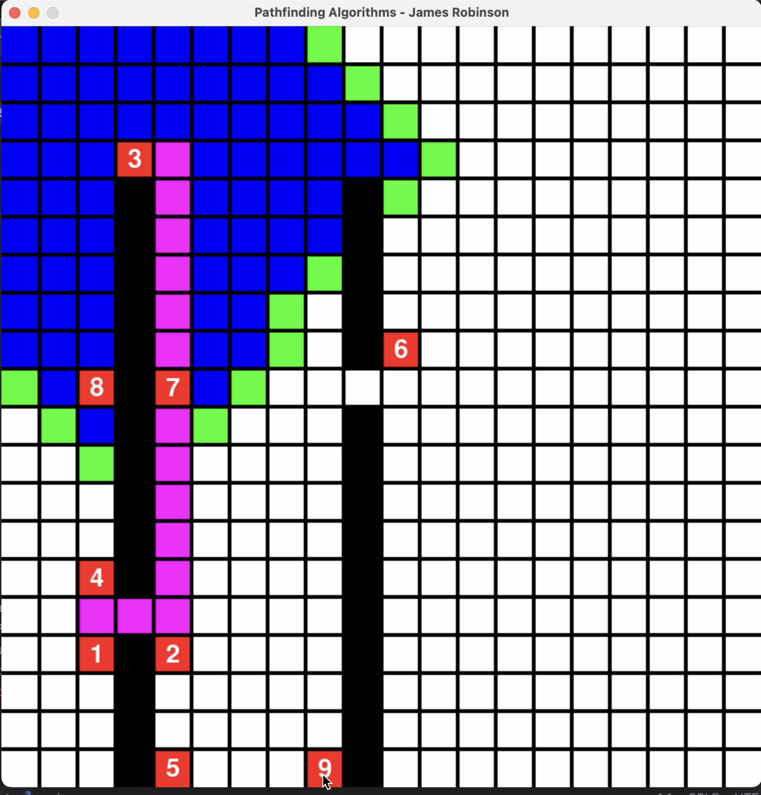

# Interactive Pathfinding Algorithm Explorer

  <!-- Replace with the actual image path -->

## Description

The **Interactive Pathfinding Algorithm Explorer** is an interactive tool designed to visualize and compare the performance of various pathfinding algorithms. It provides an intuitive platform for users to understand the efficiency and behavior of these algorithms, making it a valuable resource for students and developers alike.

### Features
- **Adjustable Grid Size:** Customize the grid dimensions to see how different sizes affect algorithm performance.
- **Real-time Path Calculation:** Observe algorithms as they compute paths in real-time when obstacles are placed.
- **Obstacle Placement:** Add and remove obstacles on the grid, testing how algorithms navigate around them.
- **Step-by-Step Exploration:** Step through the algorithm's process to observe how it finds a path from start to finish.

## Algorithms
- A*
- Dijkstra
- Depth-First Search (DFS)
- Breadth-First Search (BFS)
- Bidirectional Search

## Installation

To run this project locally, follow these steps:

1. **Clone the repository:**
   ```bash
   git clone https://github.com/yourusername/interactive-pathfinding-algorithm-explorer.git
   ```

2. **Navigate to the project directory:**
   ```bash
   cd interactive-pathfinding-algorithm-explorer
   ```

3. **Install Pygame and any other required dependencies:**
   ```bash
   pip install pygame
   pip install -r requirements.txt
   ```

4. **Run the application:**
   ```bash
   python main.py
   ```

## Usage

After launching the application, you will be presented with an interactive grid. Here’s how to use it:

### Mouse and Key Handling
- **Mouse Inputs:**
  - Left-click: Places walls (obstacles) on the grid.
  - Right-click: Removes walls.
  - Scroll: Zooms in and out, changing the grid size.

- **Key Inputs:** Use the following keys to trigger different pathfinding algorithms:
  - **q** = Depth First Search (DFS)
  - **w** = Breadth First Search (BFS)
  - **e** = Dijkstra’s Algorithm
  - **r** = A* Algorithm
  - Other keys may allow checkpoint placement, speed adjustments, or resetting parts of the grid.

### Pathfinding Algorithms
When a pathfinding algorithm is triggered (using keys like **q**, **w**, **e**, **r**), the `run_algorithm` function is called, which invokes the corresponding algorithm.

- The `pathfind` function:
  - Implements the logic for each algorithm (DFS, BFS, Dijkstra, A*).
  - Iterates through the open list (nodes to explore), evaluating each node and expanding possible paths.
  - For Dijkstra and A*, it calculates costs (distance from start and heuristic distance to the end).
  - The resulting path that connects the start and end points is then visualized.

### Visualization
The program continuously updates the visual representation of the grid using different colors to represent various elements:
- **Green:** Open list nodes (nodes being explored)
- **Blue:** Closed list nodes (nodes already explored)
- **Black:** Walls (obstacles)
- **Red:** Start/End points
- **Pink:** Final path after pathfinding completes.

## Contributing

If you would like to contribute to this project, please fork the repository and submit a pull request.

## License

This project is licensed under the MIT License - see the [LICENSE](LICENSE) file for details.


## License

This project is licensed under the MIT License - see the [LICENSE](LICENSE) file for details.

